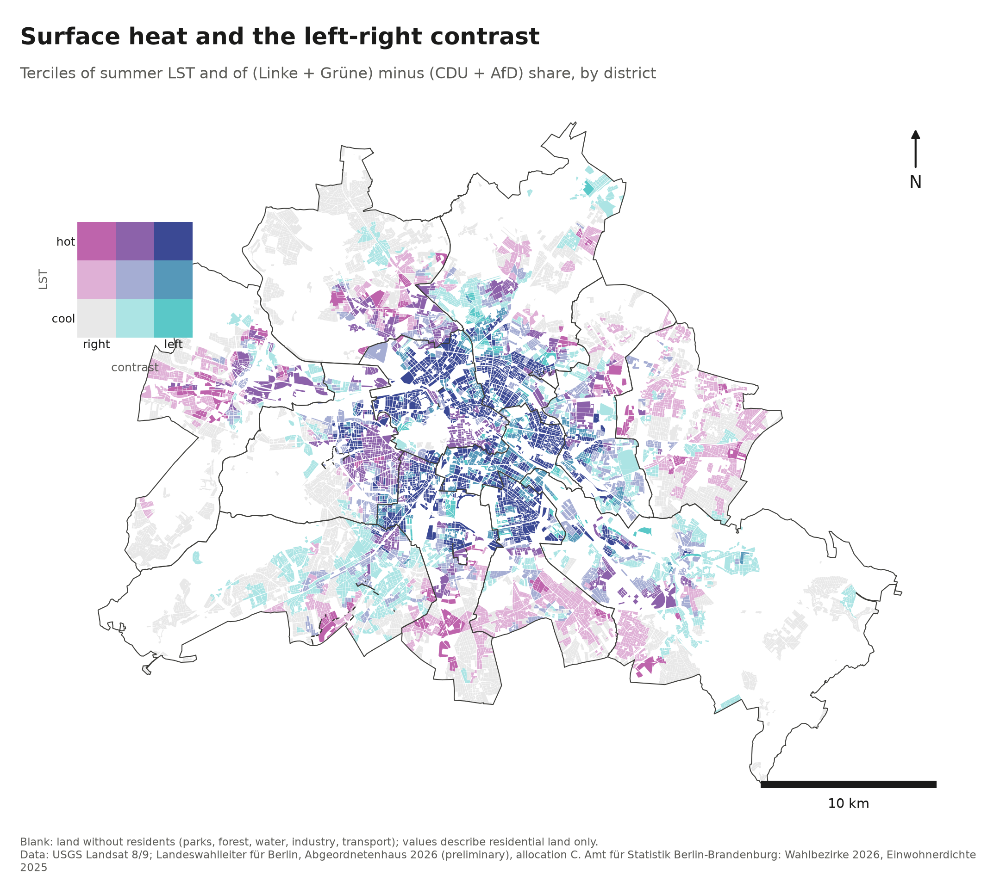
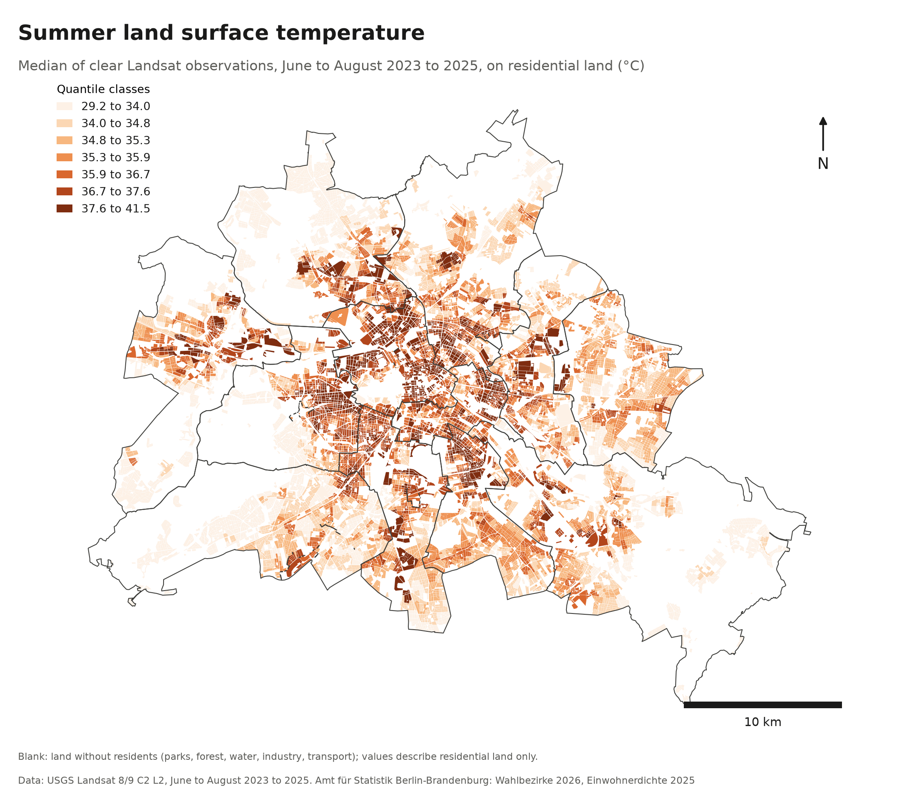
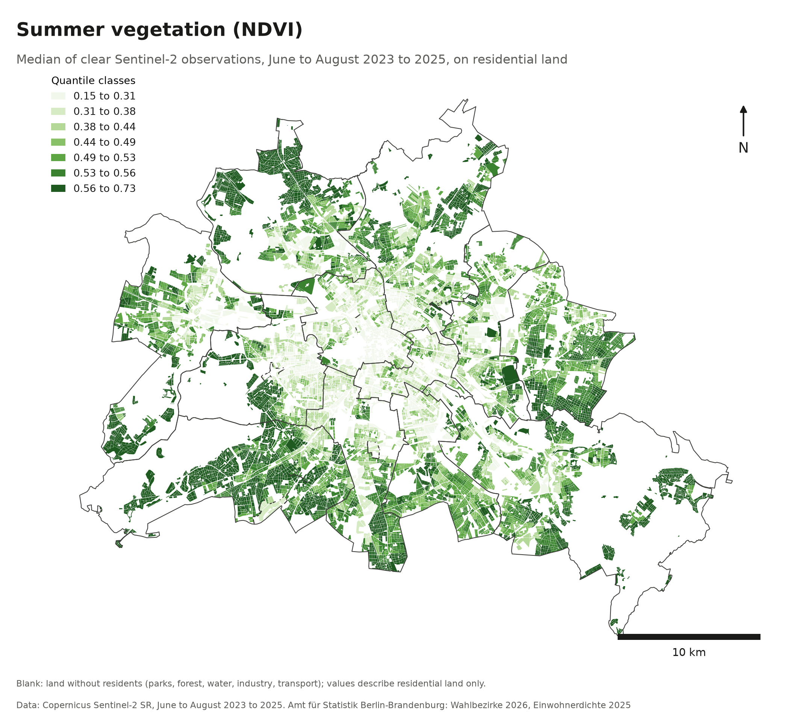
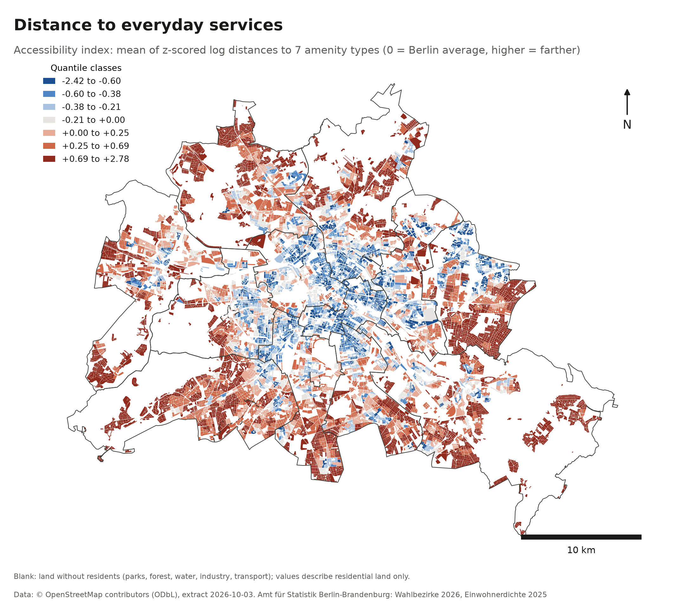
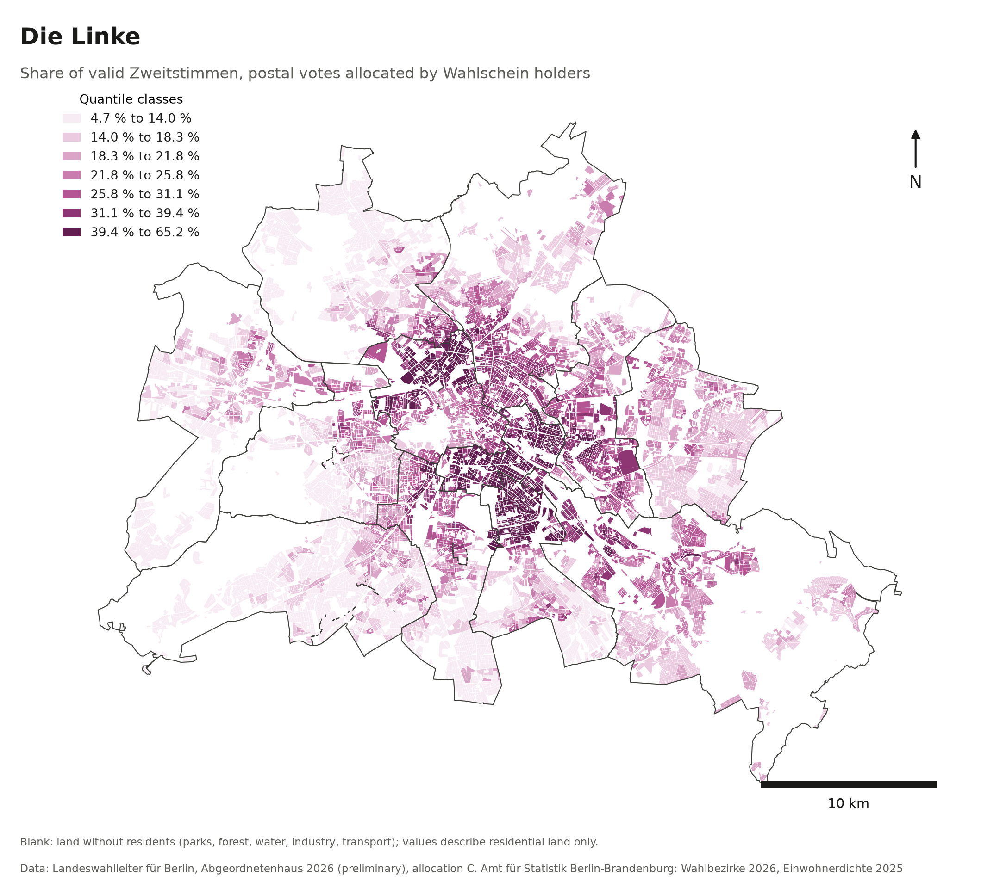
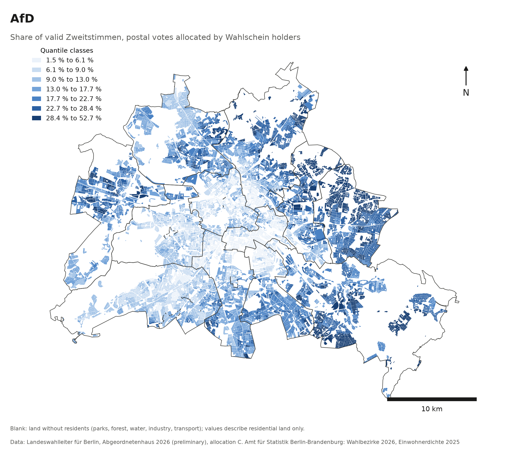
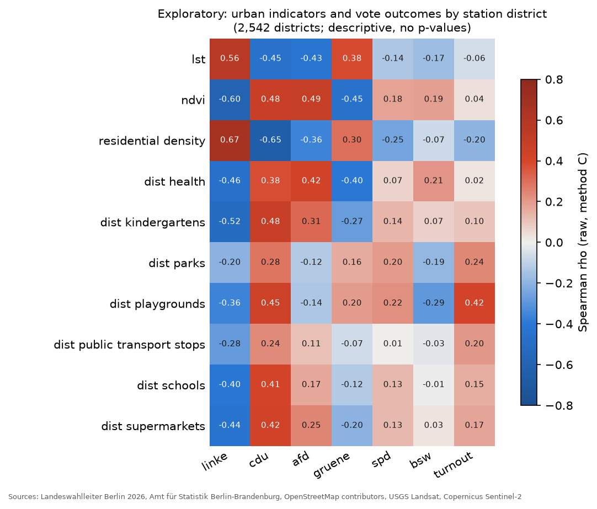
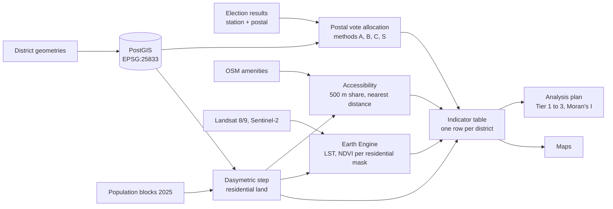

# Heat, green and the vote: Berlin 2026

[](https://github.com/giovanigoltara/Berlin_Wahl_Analysis/actions/workflows/ci.yml)

## In plain words

**The question.** Berlin's dense inner city gets much hotter in summer than its leafy outskirts. Does that line up with how neighbourhoods vote? This project compares 2,542 polling districts, each about 1,000 voters, using only public data: election results, population, OpenStreetMap and satellite images.

**What it found.**

1. **Hotter, less green districts lean towards Die Linke and the Greens, cooler and greener ones towards the CDU and AfD,** and this holds even when comparing districts that are equally dense. The pattern is clear but moderate, with many exceptions.
2. **Distance to schools, doctors and shops says almost nothing about the vote** once density is taken into account. In Berlin, access to everyday services mostly follows density.
3. **The results do not change** with how the 41 % of postal votes are assigned to districts.

**What it does not say.** These are patterns between places, not facts about people, and they are not causes: heat does not make anyone vote a certain way. Satellites measure surface temperature on clear summer mornings, not the air at night.

**Why it can be trusted.** One command rebuilds every table and map from the public sources in about 4 minutes, and GitHub repeats that every week to confirm the results come out identical. The main tests were written down before the satellite data was computed.

The rest of this page is the technical documentation.

---

How do surface temperature, vegetation and access to everyday services vary across Berlin's electoral districts, and how do these urban conditions align with party-list (Zweitstimme) results of the Abgeordnetenhaus election of 20 September 2026?

This is an ecological, descriptive analysis of 2,542 polling-station districts. Results describe districts, not voters: a district with hotter surfaces and a higher Linke share says nothing about how any individual in it voted. The election results used are the **preliminary** results (release `v0.1-preliminary`).



## Findings

All values are Spearman correlations across districts. Each is partial on log residential density, uses postal votes allocated by Wahlschein holders (method C), and is a Tier 1 test of the analysis plan fixed before any satellite value existed (`docs/methods.md`). Full tables are in [`docs/results.md`](docs/results.md).

- **Heat and greenness line up with the left-right divide even at equal density.** The left-right contrast, (Linke + Grüne) minus (CDU + AfD) share, correlates with summer surface temperature at rho = +0.42 and with NDVI at rho = -0.43. AfD shares are higher in greener districts (rho = +0.37). Without the density control the same associations are stronger (+0.60, -0.65), so part of them is shared with density.
- **Access to everyday services barely relates to the vote once density is held equal.** The accessibility index correlates with the contrast at -0.48 raw but only -0.07 partial; for Grüne and AfD the sign reverses. In Berlin, distance to services mostly tracks density.
- **Surface temperature and turnout are unrelated** (rho = +0.04).
- **Stability:** every Tier 1 result keeps its sign and moves by at most 0.043 across allocation methods A, B and C, station votes only, without the 15 districts whose 2025 population and 2026 register disagree, and with the SPD added to the contrast.
- **Uncertainty:** all variables cluster strongly in space (Moran's I 0.28 to 0.92), so the effective sample is far smaller than 2,542. The confidence intervals and p-values assume independent districts and are too narrow; the effect sizes are the result.

| Summer surface temperature | Summer NDVI | Distance to services |
| --- | --- | --- |
|  |  |  |
| **Die Linke** | **AfD** | **Exploratory correlations** |
|  |  |  |

Maps draw each district's value on its residential land only; blank areas are parks, forest, water, industry and transport.

## Data

| Source | Content | Licence |
| --- | --- | --- |
| Landeswahlleiter für Berlin | Zweitstimme results 2026 by station and postal district (preliminary) | CC BY 3.0 DE |
| Amt für Statistik Berlin-Brandenburg | Polling-district geometries 2026 | CC BY 3.0 DE |
| Amt für Statistik Berlin-Brandenburg, Umweltatlas | Residents per block, 2025 (WFS) | CC BY 3.0 DE |
| OpenStreetMap via Geofabrik | Amenities, extract of 2026-10-03 | ODbL 1.0 |
| USGS Landsat 8/9 C2 L2 (Google Earth Engine) | Surface temperature, summers 2023 to 2025 | Public domain |
| Copernicus Sentinel-2 SR, Cloud Score+ (Google Earth Engine) | NDVI, summers 2023 to 2025 | Copernicus terms; CC BY 4.0 |

URLs, retrieval dates, SHA-256 hashes and the licence text of each source as stated by its provider are in [`docs/provenance.md`](docs/provenance.md). Every output column is described in [`docs/data_dictionary.md`](docs/data_dictionary.md), and `datapackage.json` describes the committed tables (Frictionless Data).

## Method



1. **Postal votes** (40.8 % of valid votes) are reported for postal districts covering 1 to 4 station districts. They are allocated by station valid votes (A), eligible voters (B) or Wahlschein holders (C, primary, r = 0.997 with actual postal voters), or dropped (S). `sql/20_postal_allocation.sql`
2. **Residential land** comes from intersecting districts with 2025 population blocks and excluding open land and infrastructure; residents are conserved exactly. `sql/30_dasymetric.sql`
3. **Accessibility** is the residents-weighted distance to the nearest of 7 amenity types from OpenStreetMap, summarised as a z-scored index. `src/osm_extract.py`, `sql/40_accessibility.sql`
4. **Surface temperature and NDVI** are per-pixel medians of clear summer observations, reduced over each district's residential land in Earth Engine. `src/gee_extract.py`, `sql/35_satellite.sql`
5. **Analysis** follows a plan committed before the satellite data existed: 16 confirmatory partial correlations with Holm correction, robustness variants, an exploratory grid, and Moran's I. `sql/50_indicators.sql`, `src/analysis.py`

Every step writes checks to [`docs/validation_report.md`](docs/validation_report.md) and stops the pipeline if one fails. Among them: allocated votes reproduce the official Berlin totals, all geometries are valid, residents are conserved, and the area Earth Engine reduced matches PostGIS within 0.5 %. Details and the two documented deviations from the analysis plan are in [`docs/methods.md`](docs/methods.md).

## Limitations

- **Ecological inference.** Associations between districts do not describe individuals.
- **Postal allocation.** Postal voters within a postal district are assumed to vote alike, whichever station district they live in. The methods differ only in how many postal votes each station receives.
- **Timing.** Imagery covers the summers of 2023 to 2025 and population 2025, while the election and the voter register date from 2026. Fifteen districts where the register exceeds the population are flagged and checked.
- **What LST measures.** Landsat surface temperature is the daytime (about 10:30) temperature of roofs, pavement and vegetation under clear skies. It is a proxy for heat exposure, not air temperature, and says nothing about night-time heat. Some pixels have permanent gaps in the Landsat product (19 zones below 95 % coverage).
- **Accessibility.** Distances are straight lines, not walking routes, and OpenStreetMap completeness varies; services across the Brandenburg border are only partly included.
- **Scale (MAUP).** Results depend on the polling-district geometry; other units could give other values.
- **Spatial dependence.** Strong clustering makes the p-values too small; read the effect sizes.
- **Preliminary results.** Final results may differ slightly; a rerun is planned (issue #11).

## Reproduce

Requirements: Docker with Compose v2, [uv](https://docs.astral.sh/uv/), GNU Make and about 3 GB of disk space.

```bash
git clone https://github.com/giovanigoltara/Berlin_Wahl_Analysis.git
cd Berlin_Wahl_Analysis
make setup   # create .env, install the pinned Python environment
make all     # download, load, analyse and map; satellite values from data/processed (see below)
```

`make all` runs every step from the raw downloads; from a fresh clone it took 4 minutes, downloads included, and every output matched the committed version. Earth Engine needs your own account, so by default the satellite step loads the committed Earth Engine results (`data/processed/ee_zonal.csv`, `make gee-from-csv`). With credentials set up (next section), `make all SATELLITE=gee` recomputes them as well, which takes about 75 minutes. `make help` lists every target. `make check` runs the static checks, and `make reproduced` confirms after a run that every committed output was regenerated unchanged. GitHub Actions runs both: the checks on every push, and the full pipeline from a fresh runner on every push to `main` and weekly.

### Earth Engine credentials (optional)

1. Create or choose a Google Cloud project and register it for Earth Engine at <https://code.earthengine.google.com/register> (noncommercial use is free for research and education). Enable the Earth Engine API in that project.
2. Authenticate once with `uv run earthengine authenticate`. This stores credentials under `~/.config/earthengine/`, outside the repository.
3. Put the project ID in `.env` as `EE_PROJECT=your-project-id`, and check with `make ee-check`.

For unattended runs, use a service account with the roles "Earth Engine Resource Viewer" and "Service Usage Consumer". Set `EE_SERVICE_ACCOUNT_KEY` to its JSON key, raw or base64 on one line. `src/ee_auth.py` uses the key from memory and never writes it to disk. Revoke the key when the project ends.

## Repository layout

| Path | Content |
| --- | --- |
| `config/params.yaml` | Every tunable parameter: CRS, dates, thresholds, buffers, the analysis plan |
| `sql/` | Spatial SQL run inside PostGIS, numbered in execution order |
| `src/` | Python: download, load, Earth Engine, OSM, analysis, maps |
| `data/processed/` | Committed results: Earth Engine zonal statistics, correlation tables |
| `docs/` | Methods, provenance, data dictionary, validation report, results |
| `figures/` | Maps (PNG 300 dpi and SVG) and charts |

Working CRS is EPSG:25833 (ETRS89 / UTM zone 33N) for all metric operations.

## Credits and citation

Danila Morkovkin's [dot-density map of the 2026 Berlin election](https://danilamorkovkin.blog/berlin-election-2026/) showed the results at fine resolution first. This project does not replicate it: it adds urban indicators, and it reconciles postal and station votes.

Developed with Claude Code (Anthropic) as a coding assistant; the research question, data choices, analysis plan and interpretation are mine.

To cite this work, see `CITATION.cff`. Code: MIT (`LICENSE`). Derived tables in `data/processed/`: ODbL 1.0, because they include values derived from OpenStreetMap. Source licences are listed in `docs/provenance.md`.
