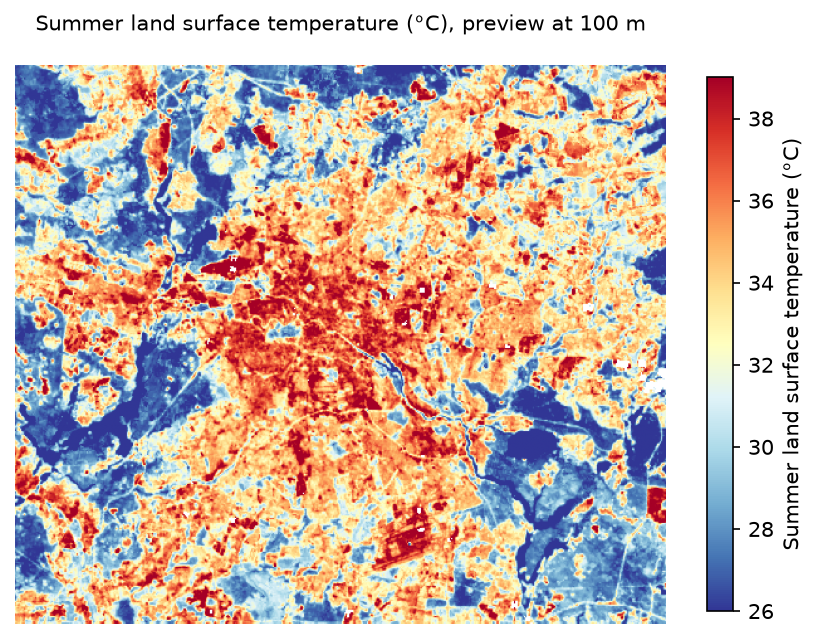
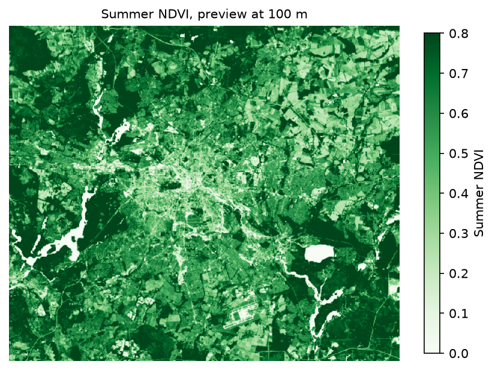

# Heat, green and the vote: Berlin 2026

> Work in progress. Phases 0 (setup) and 1 (acquisition and inspection) are complete. Phase 2 (PostGIS load, postal vote allocation, dasymetric population, OSM accessibility) and Phase 3 (Earth Engine surface temperature and NDVI) are complete; indicators and analysis (Phase 4) are next. See `docs/validation_report.md` and `docs/methods.md`.

How do surface temperature, vegetation and access to everyday services vary across Berlin's electoral districts, and how do these urban conditions align with party-list (Zweitstimme) results of the Abgeordnetenhaus election of 20 September 2026?

This is an ecological, descriptive analysis at district level. Results describe districts, not individual voters, and must not be read as individual-level conclusions.

## Requirements

- Docker with Docker Compose v2
- [uv](https://docs.astral.sh/uv/) (installs Python 3.11 and the pinned dependencies from `uv.lock`)
- GNU Make
- A Google account with Earth Engine access (Phase 3 only)

## Quick start

```bash
make setup      # create .env from .env.example, install the pinned Python environment
make db-check   # start PostGIS and print PostgreSQL, PostGIS, GEOS and PROJ versions
make help       # list all pipeline targets
```

`make all` runs the full pipeline. Targets for phases that are not implemented yet exit with an error instead of silently succeeding.

Earth Engine needs your own credentials (below). Without them, `make gee-from-csv` loads the committed results in `data/processed/ee_zonal.csv` instead of `make gee`, and every later step runs the same.

| Summer land surface temperature, 2023 to 2025 | Summer NDVI, 2023 to 2025 |
| --- | --- |
|  |  |

## Manual setup

These steps need your own accounts and cannot be scripted.

### Google Earth Engine

1. Create or choose a Google Cloud project and register it for Earth Engine at
   <https://code.earthengine.google.com/register> (noncommercial use is free for research and education).
2. In that project, enable the Earth Engine API (Google Cloud console, "APIs and services").
3. Authenticate once on your machine:
   ```bash
   uv run earthengine authenticate
   ```
   This stores credentials under `~/.config/earthengine/`, outside the repository.
4. Put the project ID in `.env`:
   ```
   EE_PROJECT=your-project-id
   ```
5. Check the setup with `make ee-check`, which runs a small test query.

For unattended runs (a CI job or a cloud environment) use a service account instead of step 3:

1. In the same project, "IAM and admin", "Service accounts", create an account and grant it the roles "Earth Engine Resource Viewer" and "Service Usage Consumer".
2. Create a JSON key for it ("Keys", "Add key").
3. Set `EE_SERVICE_ACCOUNT_KEY` to the key, either the JSON itself or its base64 on one line (`base64 -w0 key.json` on Linux, `base64 -i key.json` on macOS). `src/ee_auth.py` uses it from memory and never writes it to disk.
4. Delete the key file from your machine once it is stored, and revoke the key when the project ends.

## Repository layout

| Path | Content |
| --- | --- |
| `config/params.yaml` | All tunable parameters: CRS, dates, cloud thresholds, buffer distances |
| `sql/` | Spatial SQL run inside PostGIS, numbered in execution order |
| `src/` | Python orchestration: download, load, Earth Engine, OSM, analysis, maps |
| `data/raw`, `data/interim` | Regenerated by the pipeline, not versioned |
| `data/processed` | Small final tables, versioned |
| `docs/` | Methods, provenance, data dictionary, validation report |
| `figures/` | Published maps and charts |

Working CRS is EPSG:25833 (ETRS89 / UTM zone 33N) for all metric operations.

## Licence

Code: MIT (see `LICENSE`). Licences of the input data are recorded per source in `docs/provenance.md`.
